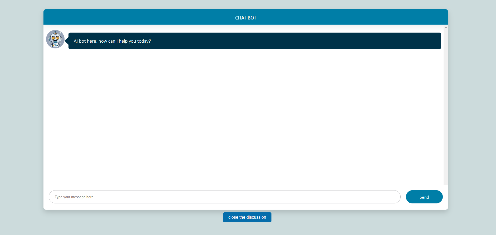

# Flask-OpenAI-Chatbot
An application built with Flask, featuring a chatbot empowered by OpenAI's GPT-3.5 Turbo, capable of mimicking various characters. Users can engage with distinct personas, each characterized by their own backgrounds and personalities. Furthermore, it boasts an intuitive chatbot interface crafted in HTML for user convenience

### Prerequisites

- Python 3.7+ .
- Flask 2.0.1 .
- OpenAi + OpenAI valid Key.

### Installation

1. Clone this repository to your local machine.

2. Install the required Python packages under 'requirements.txt'.
 
3. Configure your OpenAI API key.
4. Start the Flask application through running app.py.

### Application Preview

